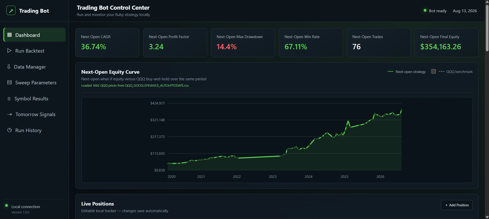

# Ruby Trading Strategy Backtester

A full-stack backtesting application built with Ruby and Sinatra. The project imports historical daily market data, evaluates configurable strategy rules across one or more symbols, calculates portfolio performance, and presents the results in a browser-based dashboard.

The application was created to turn a command-line research tool into a more accessible workflow with saved configurations, interactive results, run history, charts, and signal reporting.

> This is an educational software and historical-simulation project. It does not connect to a brokerage or place live trades. Historical results do not predict future performance.

## Dashboard Preview

[](docs/images/GUI_image1.jpg)

## Highlights

- Run backtests for one symbol or a group of symbols
- Test a shared portfolio with a one-position mode
- Configure the date range and starting equity
- Adjust RSI, breakout, moving-average, ATR, stop-loss, take-profit, and time-based exit rules
- Perform parameter sweeps across multiple configurations
- Calculate CAGR, profit factor, maximum drawdown, win rate, total return, and final equity
- Display yearly performance and recent strategy signals
- Compare the simulated equity curve with a QQQ benchmark
- Save and reload strategy presets
- Store previous runs and reopen their results
- Display current simulated positions and potential next-session signals
- Read daily OHLCV data from local CSV files

## Dashboard

The Sinatra interface provides one place to configure a run and review its output. Results can include:

- A multi-symbol summary table
- Portfolio-level statistics
- Equity and benchmark curves
- Annual returns
- Recent signals for each symbol
- Simulated position information
- Saved presets and run history

## Technology

- **Ruby** — backtesting engine, strategy rules, data processing, and statistics
- **Sinatra** — web application and request handling
- **ERB / HTML / CSS / JavaScript** — dashboard interface and result presentation
- **CSV / JSON** — historical data, presets, results, and run history
- **Bundler** — Ruby dependency management

## How It Works

1. The user selects symbols, dates, portfolio settings, and strategy parameters.
2. The application loads daily OHLCV data from CSV files.
3. The backtesting engine calculates indicators and evaluates entry and exit rules without using future data.
4. Simulated trades are processed using the configured execution and portfolio assumptions.
5. The application calculates trade-level and portfolio-level statistics.
6. Results are saved and displayed in the web dashboard.

## Strategy Components

The engine supports combinations of:

- Short-period RSI signals
- Price breakout entry and exit rules
- Simple moving-average trend filters
- ATR-based risk and profit rules
- Fixed-percentage stops and profit targets
- Time-based exits
- Per-symbol parameter overrides
- Market and volatility filters

These components are configurable research inputs. The repository demonstrates the software architecture and testing workflow rather than recommending a particular strategy.

## Performance Statistics

Depending on the selected mode, the application reports:

| Metric | Description |
| --- | --- |
| Trades | Number of completed simulated trades |
| CAGR | Compounded annual growth rate of the simulation |
| Profit Factor | Gross simulated profit divided by gross simulated loss |
| Maximum Drawdown | Largest peak-to-trough portfolio decline |
| Win Rate | Percentage of completed trades with a positive return |
| Total Return | Overall percentage change during the selected period |
| Final Equity | Ending simulated portfolio value |

## Running Locally

### Requirements

- Ruby
- Bundler
- Historical daily OHLCV data in the expected CSV format

### Installation

```bash
git clone https://github.com/MaxRomano-dev/ruby-trading-backtester.git
cd ruby-trading-backtester
bundle install
```

### Start the Web Application

```bash
bundle exec ruby gui/app.rb
```

Then open:

```text
http://localhost:4567
```

The application is local by default and is not publicly accessible unless the server configuration is intentionally changed.

## Data Format

Demonstration datasets for NVDA, DELL, QQQ, and VIXY are included in `data/clean/`. NVDA and DELL can be selected for demonstration backtests, while QQQ and VIXY support benchmark comparisons and market filters.

Additional local market-data files placed in `data/clean/` are ignored by Git unless explicitly allowed in `.gitignore`.

Each CSV uses the following fields:

```text
date,open,high,low,close,volume
```

## Project Structure

```text
.
├── trading_bot.rb         # Command-line entry point
├── Gemfile                # Sinatra and Puma dependencies
├── README.md
├── lib/
│   ├── trading_bot/
│   │   ├── bootstrap.rb
│   │   ├── helpers.rb
│   │   ├── backtester.rb
│   │   ├── runner.rb
│   │   └── metrics_finalizer.rb
│   └── symbol_policies/
├── gui/
│   ├── app.rb             # Sinatra application
│   ├── config.yml
│   ├── views/index.erb
│   └── public/            # CSS and JavaScript
├── data/clean/            # Local market data (ignored by Git)
├── storage/               # Generated results (ignored by Git)
└── docs/images/           # README screenshots
```

The command-line engine is separated from the browser interface so each can be run and maintained independently.

## Engineering Challenges

Some of the main engineering problems addressed in this project include:

- Keeping multi-symbol portfolio state consistent
- Avoiding overlapping positions in one-position mode
- Separating strategy parameters from user-interface inputs
- Handling incomplete or malformed market-data files
- Preserving run history and saved configurations
- Producing both trade-level and portfolio-level reports
- Comparing a strategy simulation with a benchmark over matching dates
- Presenting long-running backtests through a usable browser interface

## Limitations

- The current research model primarily uses daily OHLCV bars.
- Intraday price order is unknown when both a target and stop occur within the same daily bar.
- Simulation results depend on assumptions for fills, fees, slippage, and data quality.
- The application is designed primarily for local, single-user use.
- It is not a live execution or financial-advice system.

## Planned Improvements

- Continue dividing the largest engine and reporting modules into smaller objects
- Add automated tests for indicators, entries, exits, and portfolio accounting
- Add stronger input validation and user-friendly error messages
- Include a documented sample dataset and demonstration preset
- Improve support for separate user sessions
- Add exportable reports
- Package the application for easier installation

## What This Project Demonstrates

- Building and extending a complete Ruby application
- Translating detailed rules into working software
- Processing time-series and CSV data
- Designing a browser-based interface around an existing command-line tool
- Debugging state, data, encoding, and reporting problems
- Iteratively improving a project based on real usage
- Connecting backend calculations with persistent storage and frontend presentation

## Author

Maxime Romano

- GitHub: [MaxRomano-dev](https://github.com/MaxRomano-dev)
- Demo video: https://youtu.be/J3wijqzeO4o

## License

Copyright © 2026 Maxime Romano. All rights reserved.

This repository is publicly available for portfolio and evaluation purposes. No permission is granted to copy, modify, redistribute, or commercially use the code.
